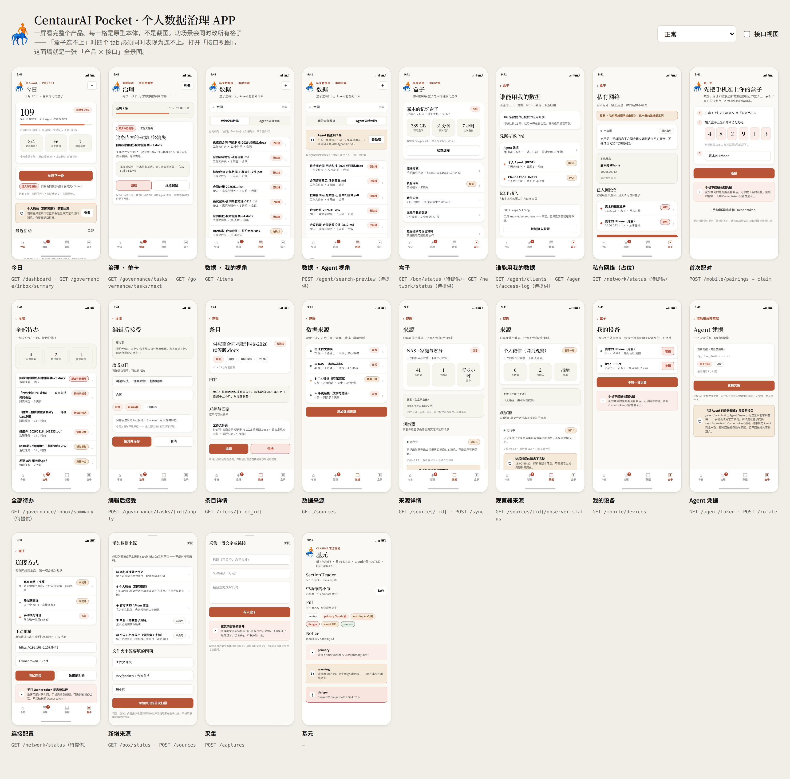

# CentaurAI Pocket · 个人数据治理 APP · 高保真原型

Pocket 是**个人级**数据治理 APP（企业级那条是 `centaurAI-datahub`，面向企业 FDE 场景，目前还没有这块业务）。
手机端是**纯客户端**：不自己实现功能，只调「盒子上跑的数据治理程序」的接口。

这份原型有两个用途：

1. 把产品设计定下来 —— 信息架构、每屏的信息层级、主行动、四种状态、实际文案；
2. **把盒子程序要提供的接口逼出来** —— 每块界面都标着它依赖哪个 `/api/v1` 端点，缺的明确标「待提供」。

原型**不碰** `centaurai-pocket` 仓库任何文件（那边全程只读），也不连真后端。

---



## 怎么打开

**要发给别人看，就发这一个文件**：`dist/CentaurAI-Pocket-原型.html`（348 KB，双击即开，
零外部请求，落地在联览墙）。它是 `node tools/bundle.mjs` 打出来的 —— CSS/JS 全部内联、
logo 换成 data URI，所以微信、邮件、U 盘随便传，对方不用装任何东西。

开发时用 `index.html`（同样双击即开）。两处的联览墙实现不同：

- `index.html#/wall` 与打包版一样，**同文档内**把每屏渲进 390×844 的缩放容器，不用 iframe；
- `wall.html` 是 iframe 版，需要起静态服务器（`file://` 下 Chrome 对 file 子 iframe 的策略不稳）：

```bash
python3 -m http.server 8791 --bind 127.0.0.1 --directory /home/user/centaurai-pocket-html-prototype
```

墙上每一格都是**原型本体**（不是会过期的截图），点进去可以真的用；顶部切场景会同时改所有格子。

---

## 视觉：Claude 官方配色 ＋ 官网 logo

嘉木 2026-08-17 指定用 **Claude 官方配色**，覆盖了原计划（原计划是搬
`centaurai-pocket` 的「金石 · 数据层中性变体」，黛青 `#3A5A78`）。

现在用的是 Anthropic / Claude 品牌色系：暖象牙纸 ＋ Claude 橙。这跟自家官网是同一路子 ——
`www.centaurloop.com` 的 legacy 首页用的就是 `#FAF7F2 / #C0755A / #A35C43 / #E8B04B`
这组暖色，与 Claude 的 ivory ＋ book cloth 家族同源。

| 角色 | 值 | 用法 |
| --- | --- | --- |
| 纸 | `#FAF9F5` / 抬升 `#F0EEE6` / 卡面 `#FFFFFF` | 背景三层 |
| 墨 | `#141413` · muted `#5F5E58` · dim `#91918D` | 正文三档 |
| Claude 橙 | `#D97757` | **只做填充/描边/进度**，对纸底约 2.9:1 |
| 橙 · 按钮底 | `#B85536` | 主按钮，白字 4.79:1 ✓ |
| 橙 · 文字 | `#A6472A` | 承载文字那一档，对纸底 5.56:1 ✓ |
| kraft 赭 | `#D4A27F` 填充 / `#8A5A32` 文字 | 提醒与高亮 |
| danger | `#B3402C` on `#F8E5DF`（4.67:1 ✓） | 危险动作 |

**两条硬约束**（写在 `styles/components.css` 顶部，并由 grep 与 selfCheck 守着）：

- `--color-primary` 与 `--color-gold` **不得作文字色** —— 它们在自己的 soft 底上都不到 3:1；
- **圆角 ≤ 内边距**（Notice 10/13、Button 10/16、card 16/16、metric 16/17）。

另外：状态不能只靠颜色，所有 Pill 与状态点都同时带文字。

**Logo** 取自官网 `/loop/assets/centaur-logo.png`（那只低多边形半人马），裁掉透明边、缩到
120×160 存在 `assets/centaur-logo.png`。原型要能离线打开，所以不引任何外链。

**字体**：Claude 的 Styrene / Copernicus 不可分发，用系统栈近似（PingFang SC 系 ＋ Songti / Noto Serif 系），
不引 CDN。⚠️ **Linux 上截图的字形不是最终效果** —— 本机 `fc-match "Noto Sans SC:lang=zh-cn"`
落到 `Noto Sans CJK TC`，`直/骨/说/门/爱` 会呈现繁体字形。真机以 PingFang SC 为准。

---

## 信息架构：底部 4 个 tab，对现状改了两处

`origin/main` 现状是 `今日 / 治理 / 同步 / 设置`。改为 **`今日 / 治理 / 数据 / 盒子`**：

- **同步 → 数据**：配置数据源是一次性动作（`product-spec.md` §2 自己写的使用节奏），
  而 `/items` 列表与检索**当前完全没有界面**。一级入口给高频且缺口大的东西，源降为二级页。
- **设置 → 盒子**：那一格装的本来就不是偏好设置，是「我和我那台盒子之间的连接与边界」。
  改名后收纳规则明确：盒子本身、怎么到达它、谁被允许读它。私有网络与 Agent 授权因此成为一级概念。

**不加第 5 个 tab** —— 数据治理是有限游戏，IA 必须收敛。

四件事的落点：私有网络 → `盒子 › 连接方式 › /box/network`（占位）；账号 → `盒子 › 我的设备`
（**不做云账号**，账号＝持有证明＋设备身份＋可撤销）；Agent 授权 → `盒子 › 谁能用我的数据`；
搜索 → `数据` tab 顶部的**双视角**。

**数据 tab 的双视角是本原型的灵魂**：`我的全部数据`（Owner，含待确认）｜`Agent 能查到的`（只有已就绪）。
同一个查询词在两个视角下的**结果差就是数据治理的价值可视化**。mock 用同一份 `items[]` 计算两边，
所以 `Owner 命中数 − Agent 命中数 ＝ excluded_count` 这个等式永远成立（当前示例：10 − 7 = 3）。

---

## 场景切换

状态全部编码进 URL，可以直接把链接甩进群里：

```
index.html#/data?view=agent&scenario=backlog&api=1
```

| 场景 | 看什么 |
| --- | --- |
| `normal` | 正常 |
| `loading` | 骨架，不闪空数字 |
| `empty` | 刚装好、还没有来源 |
| `error-offline` | 盒子连不上 —— **四个 tab 必须同时表现为连不上，一个数字都不显示** |
| `error-sync-failed` | 数据源同步失败（含「这次失败没有改变已有数据」与下次重试时间） |
| `backlog` | 治理任务堆积 147 条 |
| `observer-degraded` | 微信观察器解析器落后、6 段覆盖缺口 |

**场景是整份快照，不是按资源开关** —— 评审要的是一致性。未覆盖的端点回落到 `normal`，
新增场景只写不一样的那几条。

其它 URL 参数：`frame=0` 去掉手机外框（截图用）、`tools=0` 隐藏工具条、`api=1` 打开接口视图、
`query=` 换搜索词、`sheet=add-source|capture` 弹 modal。

---

## 接口视图（核心交付）

`?api=1` 或勾上工具条的「接口视图」，每块界面右上角会出现它依赖的端点角标：

- **Claude 橙 = Owner 域**，**kraft 赭 = Agent 域** —— 一眼看出这块数据谁能读；
- 角标带 `·待提供` / `·需改` 后缀；
- 点开是接口卡：方法、路径、认证、必需 header、失败码、`api-contract.md` 章节，
  以及**当前场景下的真实 mock 响应 JSON**（后端一眼就知道自己要返回什么）。

`wall.html` 打开接口视图，就是一张「产品 × 接口」全景图。

**待盒子程序提供／修改的清单**（按价值排序，前两条最关键）：

| 编号 | 内容 |
| --- | --- |
| **C** | `POST /agent/search-preview` —— Owner token 可调、结果集与 Agent 完全一致，额外回 `excluded_count` 与 `excluded_reasons`。现状 `/agent/search` 是 `require_agent`，`GET /agent/token` 只回前缀，所以「Agent 能查到什么」这屏今天根本渲染不出来 |
| **I** | 认证依赖不一致（已核实）：`/governance/tasks` 列表与 apply/skip 是 `require_secretary_access`，但 `{id}`/undo 和整个 `/items*` 是 `require_owner` —— **配对设备能接受一张治理卡却撤销不了**，且「数据」tab 对配对设备整体不可用。建议统一为 `require_owner_or_device` |
| A | `GET /box/status` 盒子自述（`box_id`／存储／调度器／备份／`capabilities[]`） |
| E | `GET /governance/inbox/summary` 统一待办汇总 —— 盒子里有三条 owner 判断队列，`dashboard.pending_tasks` 只数了一条 |
| F | `GET /governance/tasks/next` —— 排序 `deletion > review > 其他`，否则代价最高的 deletion 卡不会被优先推出 |
| D | `GET /agent/clients` ＋ `GET /agent/access-log`（**不落原始 query 文本**，只记长度与命中数） |
| G | `/items` 走 FTS5、补 `tags/category/source_id` 筛选与 `facets` |
| H | source DTO 补 `next_run_at` / `consecutive_failures` / `last_error_at` / `last_run_id` |
| K | `/im/conversations` 列表项带 `policy{agent_enabled,retention_days}` |
| B | 私有网络：`/network/status`、`/network/enrollments`＋`claim`、`DELETE /network/nodes/{id}`（与 `/mobile/pairings` 同构，将来可合流） |

**另记一个必须在私有网络接入前修掉的坑**：`apps/mobile/src/lib/request-generation.ts`
的 profileId 由「服务地址 ＋ Owner token」派生。切到私有网络后地址会从 `https://…` 变成
`10.66.0.x`，**同一台盒子会被判成两个 profile**，离线队列里 pending 的治理操作会永久卡住不再投递。
修法：改由 `box_id`（契约 A）＋ Owner token 派生。

---

## 验证

```bash
NODE_PATH=/home/user/centaur-executive-os-prototype/node_modules node tools/capture.mjs
```

它自己起服务器、截 390×844（DPR 2）、跑完关掉，输出到 `output/`（当前 119 张）：
每屏按自己声明的场景截图（**不做笛卡尔积**，否则一堆逐字节相同的重复图会让 `output/`
看起来像覆盖了实际没覆盖的东西），外加 `output/api/` 接口视图与 `output/00-联览.png`。
**收到任何 console error 或 pageerror 就整体非零退出。**

**`output/` 是评审集，不是穷举集** —— 每屏只截它自己有差别的那几个场景。真正穷举
「20 屏 × 7 场景」的是浏览器里那圈 133 次渲染（见下），它跑完零报错；两者一起看才是全貌。

`selfCheck()` 的七条断言全部走 `console.error`，因此被上面的门禁兜住：

1. DOM 上每个 `data-api` 都在 `endpoints.js` 里登记过；
2. 每屏 `api[]` 声明的 key 在 `ENDPOINTS` 与 mock 里都有；
3. 反向：mock 不得造出 `ENDPOINTS` 里没有的接口，`ENDPOINTS` 也不得缺 mock；
4. `#stage` 内无横向溢出（>390−32）；
5. 可点元素 `offsetHeight ≥ 32`（`ui.tsx` 的 `minHeight:44` 对应物）；
6. **每屏 `reads[]` 声明自己真正读到的字段路径，断言它们在 `normal` 快照里不是 `undefined`**
   —— 专门堵「mock 漏字段」：渲染出空白、没有报错、截图看着还挺像；
7. **纵向静默裁切**：任何 `overflow-y: hidden` 的容器若 `scrollHeight > clientHeight` 就报错。
   这条是踩过的真实坑 —— `#stage` 是 flex 容器，子元素默认可收缩，`.list` 被压小后
   会把里面的行**无声地裁掉**，行本身的 `offsetHeight` 还是 56，第 5 条抓不到它。

静态检查三条（都应为空）。第一条只查 CSS —— `scripts/screens/kitchen-sink.js`
里那几个色值是**显示给人看的说明文字**，不是样式值：

```bash
grep -rn '#[0-9A-Fa-f]\{6\}' styles/ | grep -v tokens.css
grep -rnE '(^|[;{[:space:]])color:[[:space:]]*var\(--color-(gold|primary)\)[[:space:]]*;' styles/
grep -rnE 'https?://(fonts|cdn|unpkg|jsdelivr|storage\.googleapis|centaurloop)' index.html wall.html styles/ scripts/
```

**浏览器里的穷举扫描**（20 屏 × 7 场景 ＝ 133 次渲染，含两个 sheet），在 index.html 的
控制台里跑，专门覆盖 `capture.mjs` 没截的组合：

```js
(async () => { const errs=[]; const orig=console.error; console.error=(...a)=>errs.push(a.map(String).join(' '));
  const routes=['/today','/governance','/governance/all','/data','/data?view=agent','/box','/box/network',
    '/box/devices','/box/access','/box/access/agent','/box/connection','/onboarding/pair','/kitchen-sink',
    '/data/sources','/data/sources/src-wechat-1','/data/item/it-3307','/governance/edit/gt-9001',
    '/data?sheet=add-source','/today?sheet=capture'];
  const scen=['normal','loading','empty','error-offline','error-sync-failed','backlog','observer-degraded'];
  for (const s of scen) for (const r of routes) {
    location.hash='#'+r+(r.includes('?')?'&':'?')+'scenario='+s+'&frame=0&tools=0'; Pocket.render();
    await new Promise(res=>requestAnimationFrame(()=>requestAnimationFrame(res)));
  }
  console.error=orig; return {errorCount:errs.length, errors:[...new Set(errs)]}; })()
```

`wall.html` 也要在**新标签页**里核一遍控制台（同一标签页的 console 缓冲会留着上一次导航的旧消息，
容易被误读成新错误）。当前结果：20 个 iframe 全绿。

人工核对：`直/骨/说/门/爱` 是否繁体字形；tab bar 在 844 高内完整可见；
`error-offline` 下四个 tab 全部表现为连不上，没有一屏还在展示旧数字。

---

## 目录

```
dist/CentaurAI-Pocket-原型.html   ★ 单文件分享版（bundle.mjs 产出，零外部请求）
index.html              单机位：设备框 + #stage + #sheet + #tabbar + 工具条
wall.html               桌面联览：iframe 网格（另有同文档版 #/wall）
assets/centaur-logo.png 官网 logo（裁边缩放后）
docs/screenshots/       几张给人看的图（output/ 全量不入库）
styles/  tokens.css     ★ 唯一色值来源
         base.css components.css shell.css devtools.css
scripts/ tokens.js      tab 与场景常量
         endpoints.js   ★ 接口登记表
         mock.js        ★ 场景快照（单一 world，各端点是它的计算视图）
         ui.js          ui.tsx 的字符串渲染版 + 格式化
         app.js         ★ hash 路由 + 渲染循环 + 七条自检
         devtools.js    场景切换器 + 接口浮层
         screens/*.js   逐屏（含 wall.js —— 同文档联览）
tools/   capture.mjs    Playwright 批量截图
         bundle.mjs     ★ 打单文件
output/                 截图产物（capture.mjs 每次重建，不入库）
```

## 仓库可见性

这个仓库**是私有的**，故意的：README 里写着一条**尚未修掉的认证缺陷**（配对设备能接受治理卡
却撤销不了、`/items*` 对配对设备整体不可用），还有完整的内部接口面、盒子的内网地址和产品分层策略。
要给别人看，优先发 `dist/` 那个单文件，或者在仓库设置里加 collaborator。
真要公开（例如想用 GitHub Pages 出一个链接），先把上面那条缺陷修掉、并把 README 里的
接口清单与内网地址删掉再说。

## 还没做的

- P1 屏：同步历史、覆盖缺口、会话策略、数据维护、离线队列、关于、已处理历史；
- 私有网络只画占位（自研网络的代码不在本机，也不在 `finewood2008` 账号的仓库里 —— 等嘉木给）；
- 秘书 workspace（任务、P1b 对齐协议、会议、文档、邮件）刻意不体现，后续从 Pocket 剥离到秘书 App。
